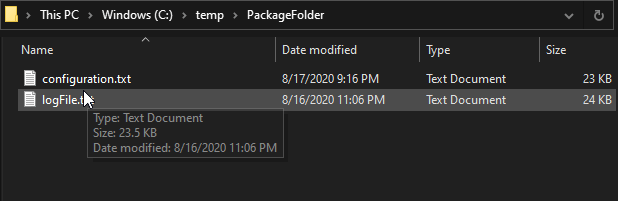
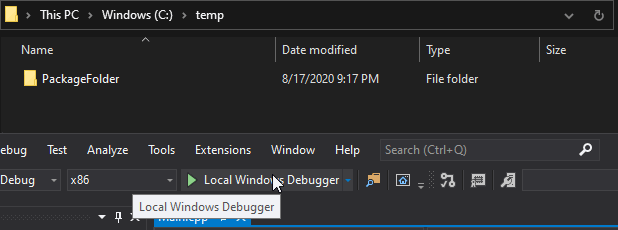

# Simple installation program
Demonstrate how to create simple program for install software according to the following requirements:
* Copy files during the installation
* Create directory (if needed) during the installation
* Atomic installation - everything or nothing
* Using WinAPI for system operations
* Using exception handling mechanism
* Using RAII for safe resources handling
---

## Demo
### Before installation:
</img>
* The package of the application contains two files: configuration.txt and logFile.txt.
* The installation needs to create new directory and move this files to it and more.
---
### After installation:
</img>
* The installation create the destination folder.
* Move files into it.
* Create additional things:
  * Create subdirectory.
  * Move file to the subdirectory.
---

## Code examples
### Using RAII for safe resource acquisition:
```C++
\* ... *\
SafeHandle hSource(CreateFileA(source.c_str(), GENERIC_READ, FILE_SHARE_READ, nullptr,
		OPEN_EXISTING, FILE_ATTRIBUTE_NORMAL, nullptr));
\* ... *\
SafeHandle hDestination(CreateFileA(destination.c_str(), GENERIC_WRITE, 0, nullptr,
	CREATE_ALWAYS, FILE_ATTRIBUTE_NORMAL, nullptr));
\* ... *\
```
* <code>CreateFileA</code> return <code>HANDLE</code> value represents system resource to the File-Object of file in the file-system.
* <code>SafeHandle</code> is structure defined using RAII pattern concepts to make sure that even if something happen and the function exists without release the HANDLE (using <code>CloseHandle</code>) it will release the handle.
---

### Using custom exception handling:
```C++
try {
	try {

		// Do stuff...
	}
	catch (MoveFileException& e) {
		// Print custom message to the user..
		throw;
	}
	catch (InvalidPathException& e) {
		// Print custom message to the user..
		throw;
	}
	catch (/* More specific exceptions can be handled */) {
		// Do other stuff..
		// Maybe abort program - hard exception...
	}
}
catch (...) {
	// Clean stuff...
}
```
* Using custom exception handling to report the user the cause of the exception and not leave him blind.
* Using nested <code>try / catch</code> block to make more code reuse, when special exception called it could passed control to outer <code>catch</code> block to handle "default" exception.
---

### Using Polymorphism and Command pattern to provide generic installation-tasks:
```C++
class Task {
//...
public:
	//...
	virtual bool DoTask() = 0;
	virtual bool UndoTask() = 0;
};


class CreateDirectoryTask : Task {
//...
public:
	//...
	virtual bool DoTask() throw (int, const char*);
	virtual bool UndoTask() throw (int, const char*);
};


class MoveFileTask : Task {
//...
public:
	//...
	virtual bool DoTask() throw (int, const char*);
	virtual bool UndoTask() throw (int, const char*);
};


int main(){
	//...
	Manager installationManager;
	
	// Setups tasks - each have DoTask() and UndoTask():
	CreateDirectoryTask* t1 = new CreateDirectoryTask(...);
	MoveFileTask* t2 = new MoveFileTask(...)
	MoveFileTask* t3 = new MoveFileTask(...)

	// Add generic tasks:
	installationManager.Add((Task*)t1);
	installationManager.Add((Task*)t2);
	installationManager.Add((Task*)t3);
	
	manager.Install();
}
```
* Using base abstract class <code>Task</code> to enforce every derived class to have two important methods: <code>DoTask()</code> and <code>UndoTask()</code>.
* Each derived class support preforming the task and undoing it if needed.
* Using data structure of the base class we can use the different types of tasks and preform dynamic actions without knowing the inner logic and implementation of the task.
---

## TODO
- [ ] Add more specific exception handling
- [ ] Change to usage of <code>ASCII</code> to <code>TCHAR</code>
- [ ] Replace usage to By-Reference where ever it can be
- [ ] <code>delete</code> default constructors and operators
- [ ] Add more RAII implementation if needed
---